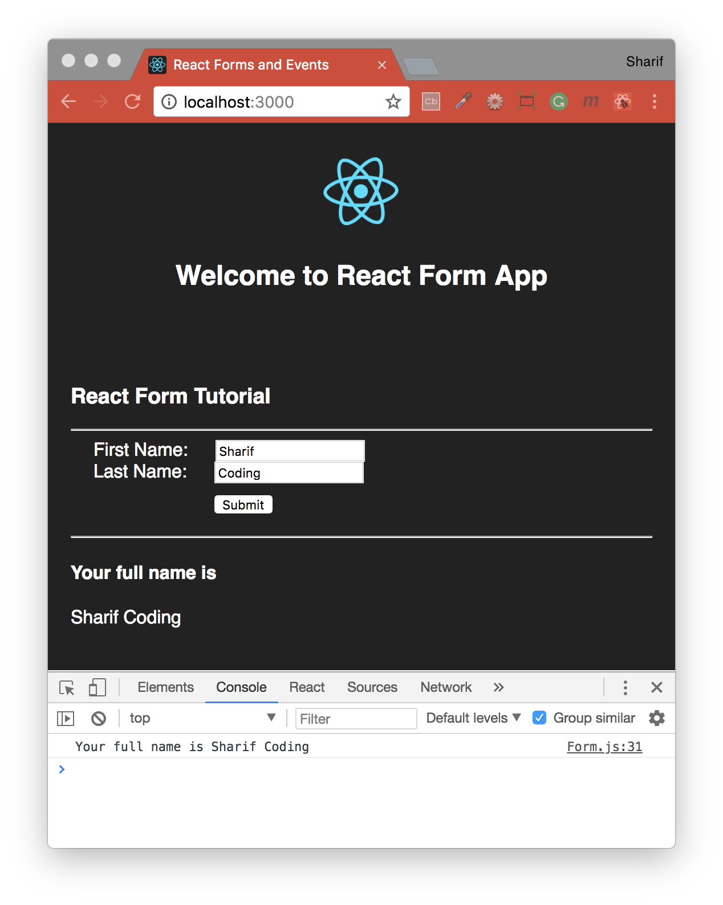

## Understanding Forms and Events in React
Learn about forms and events in React by creating a simple React-based app and then add a form and some elements, then add events to the form elements.

Tutorial grabbed from [here](https://code.tutsplus.com/tutorials/understanding-forms-and-events-in-react--cms-27852), credit to [Roy Agasthyan](https://tutsplus.com/authors/roy-agasthyan)



#### Built with
* [npm](https://www.npmjs.com/) - Node Package Manager
* [Create React App](https://github.com/facebook/create-react-app) - Create React apps with no build configuration.

#### Installation
To run this project you will need to download it onto your local machine and install all dependencies.
Navigate inside the folder and install all dependencies by entering the following command on your terminal window:
```
npm install
```
Finally to run the server enter the following command in your terminal window:
```
npm start
```
This will run the server, open [http://localhost:3000](http://localhost:3000) to view it in the browser. If you make any changes and save the changes process will automatically refresh and you will be able to see the results in the browser.

If you want to end the process hold `control` and press `c` in mac, if you are not using mac hold `ctrl` and press `c`.

#### Summary
Now we want a way to access the event payload of our input which we can do with `onChange`, a React synthetic event. We need to capture the payload and store it in our local state. In React data flows down in a unidirectional way from parent to child components. In this case we’re sending data up from a component to the state so we must use a callback function.

Callbacks are a core part of JavaScript and allow us to pass in functions as arguments. We’ll create a handler callback function `handleChange` which will “handle” the result of our event payload. Then we need to bind this new method to our `FormComp` component and update the state with `setState()`.

#### Review
- we created an input and then used `onChange` to capture the event payload in a callback function called `handleChange`
- added a `value` to make our input a controlled component
- wrote a `handleChange` method and accessed the event payload `event` to update username with the value of the input
- bound `handleChange` to our `FormComp` component
- set an initial value for `firstName` and `lastName`

#### Simple Example
In the following example, we will set an input form with `value = {this.state.data}`. This allows to update the state whenever the input value changes. We are using `onChange` event that will watch the input changes and update the state accordingly.
```js
import React from 'react';

class App extends React.Component {
   constructor(props) {
      super(props);
      
      this.state = {
         data: 'Initial data...'
      }
      this.updateState = this.updateState.bind(this);
   };
   updateState(e) {
      this.setState({data: e.target.value});
   }
   render() {
      return (
         <div>
            <input type = "text" value = {this.state.data} 
               onChange = {this.updateState} />
            <h4>{this.state.data}</h4>
         </div>
      );
   }
}
export default App;
```
#### Complex Example
In the following example, we will see how to use forms from child component. `onChange` method will trigger state update that will be passed to the child input `value` and rendered on the screen. A similar example is used in the Events chapter. Whenever we need to update state from child component, we need to pass the function that will handle updating `(updateState)` as a prop `(updateStateProp)`.
```js
import React from 'react';

class App extends React.Component {
   constructor(props) {
      super(props);
      
      this.state = {
         data: 'Initial data...'
      }
      this.updateState = this.updateState.bind(this);
   };
   updateState(e) {
      this.setState({data: e.target.value});
   }
   render() {
      return (
         <div>
            <Content myDataProp = {this.state.data} 
               updateStateProp = {this.updateState}></Content>
         </div>
      );
   }
}
class Content extends React.Component {
   render() {
      return (
         <div>
            <input type = "text" value = {this.props.myDataProp} 
               onChange = {this.props.updateStateProp} />
            <h3>{this.props.myDataProp}</h3>
         </div>
      );
   }
}
export default App;
```